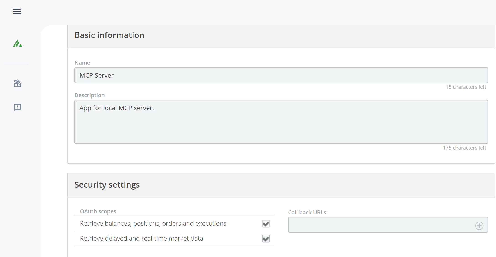
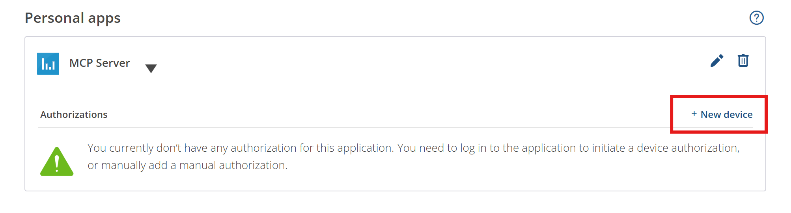
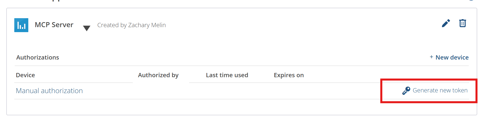

# Questrade MCP Server

[](https://badge.fury.io/js/questrade-mcp-server)
[](https://github.com/zachmelin/QuestradeMCP/actions/workflows/release.yml)

An **unofficial** Model Context Protocol (MCP) server for integrating with the Questrade API, providing access to trading accounts, market data, and portfolio information.

> **⚠️ Disclaimer**: This is an unofficial, community-built integration and is not affiliated with, endorsed by, or supported by Questrade Inc. Use at your own risk.

## Features

- 🔐 **Authentication**: OAuth 2.0 token management with automatic refresh
- 📊 **Account Data**: Access accounts, positions, balances, and order history
- 📈 **Market Data**: Real-time quotes, symbol search, and historical candles
- 🛡️ **Error Handling**: Comprehensive error handling and logging
- 🔧 **TypeScript**: Full TypeScript support with proper type definitions

## Installation

### Option 1: Install from npm (Recommended)

```bash
npm install -g questrade-mcp-server
```

### Option 2: Clone and Build

1. Clone this repository
2. Install dependencies:
   ```bash
   npm install
   ```

3. Copy the environment template:
   ```bash
   cp .env.example .env
   ```

4. Configure your Questrade API credentials in `.env`:
   ```env
   QUESTRADE_API_URL=https://api01.iq.questrade.com
   QUESTRADE_REFRESH_TOKEN=your_refresh_token_here
   # QUESTRADE_TOKEN_DIR=/path/to/custom/directory
   ```

## Getting Questrade API Credentials

For detailed information about Questrade's API authorization, see the [official API documentation](https://www.questrade.com/api/documentation/authorization).

### Step 1: Generate API Token
1. Log in to your [Questrade account](https://login.questrade.com) or navigate directly to [https://apphub.questrade.com/UI/UserApps.aspx](https://apphub.questrade.com/UI/UserApps.aspx)
2. In the top right corner, select **"API centre"** from the drop-down menu under your login name

   

3. Click **"Activate API"** and agree to the API access agreement
4. Click **"Generate new token"** for manual authorization

   

5. Copy the **refresh token** provided

   

### Step 2: Configure Environment
1. Copy your refresh token to `.env`:
   ```env
   QUESTRADE_REFRESH_TOKEN=your_refresh_token_here
   ```

2. The MCP server will automatically:
   - Use your refresh token to get an access token
   - Discover the correct API server URL
   - Handle token refresh when needed
   - Persist new tokens to `~/.questrade-mcp/tokens.json` (or system temp directory as fallback)

> **Important**: Refresh tokens are single-use only. The server will attempt to persist new refresh tokens to `~/.questrade-mcp/tokens.json` (configurable via `QUESTRADE_TOKEN_DIR` environment variable), but if a token expires or gets used by another process, you'll need to manually generate a new one following the steps above.

### Step 3: Test Your Setup
Verify your token works correctly:
```bash
npm run test-connection
```

> **Note**: If you get a "'tsx' is not recognized" error, the test script will automatically build the project first and use Node.js instead.

## Usage

### Development
```bash
npm run dev
```

### Production
```bash
npm run build
npm start
```

### Adding to Claude Desktop

1. **Find your Claude Desktop config file**:
   - **Windows**: `%APPDATA%\Claude\claude_desktop_config.json`
   - **macOS**: `~/Library/Application Support/Claude/claude_desktop_config.json`
   - **Linux**: `~/.config/Claude/claude_desktop_config.json`

2. **Add the MCP server configuration**:

   **Quick setup (Recommended)**
   ```json
   {
     "mcpServers": {
       "questrade": {
         "command": "npx",
         "args": ["questrade-mcp-server"],
         "env": {
           "QUESTRADE_REFRESH_TOKEN": "your_refresh_token_here"
         }
       }
     }
   }
   ```

   **Local development build**
   ```json
   {
     "mcpServers": {
       "questrade": {
         "command": "node",
         "args": ["/path/to/your/project/dist/index.js"],
         "env": {
           "QUESTRADE_REFRESH_TOKEN": "your_refresh_token_here"
         }
       }
     }
   }
   ```

3. **If using local build, update the path** to match your actual project location

4. **Restart Claude Desktop**

5. **Test the connection** by asking Claude to show your Questrade accounts

For detailed setup instructions, see `claude-desktop-config.md`.

## Available Tools

### Account Management
- `get_accounts` - Get all Questrade accounts
- `get_positions` - Get positions for a specific account
- `get_balances` - Get balances for a specific account
- `get_orders` - Get order history for an account

### Market Data
- `search_symbols` - Search for symbols by prefix
- `get_symbol` - Get detailed symbol information
- `get_quotes` - Get real-time quotes for symbols
- `get_candles` - Get historical price data

### Authentication
- `refresh_token` - Refresh the API access token

## Built-in Prompts

The MCP server includes helpful prompts for common trading analysis tasks:

### Portfolio Summary
**Prompt**: `portfolio_summary`
- Get a comprehensive portfolio analysis with account balances, positions, and performance
- Optional: Specify `accountNumber` (uses first account if not provided)

### Stock Analysis  
**Prompt**: `stock_analysis`
- Analyze a specific stock with current quotes, symbol information, and recent performance
- Required: `symbol` (e.g., "AAPL", "TSLA", "MSFT")

### Trading Opportunities
**Prompt**: `trading_opportunities`
- Identify potential trading opportunities based on current positions and market data
- Optional: `accountNumber` (uses first account if not provided)
- Optional: `riskLevel` ("conservative", "moderate", or "aggressive")

### Example Usage
Simply ask Claude:
- "Use the portfolio_summary prompt to analyze my trading account"
- "Analyze AAPL stock using the stock_analysis prompt"
- "Show me trading opportunities with conservative risk level"

## Tool Examples

### Get Accounts
```json
{
  "name": "get_accounts"
}
```

### Get Positions
```json
{
  "name": "get_positions",
  "arguments": {
    "accountNumber": "12345678"
  }
}
```

### Search Symbols
```json
{
  "name": "search_symbols",
  "arguments": {
    "prefix": "AAPL",
    "offset": 0
  }
}
```

### Get Quotes
```json
{
  "name": "get_quotes",
  "arguments": {
    "symbolIds": [8049, 9291]
  }
}
```

## Configuration

The server uses environment variables for configuration:

- `QUESTRADE_API_URL`: Base URL for Questrade API (default: https://api01.iq.questrade.com)
- `QUESTRADE_REFRESH_TOKEN`: Your API refresh token  
- `QUESTRADE_TOKEN_DIR`: Custom directory for token storage (default: `~/.questrade-mcp`)

## Error Handling

The server includes comprehensive error handling for:
- Invalid or expired tokens (automatic refresh)
- Missing required parameters
- API rate limits and network errors
- Invalid account numbers or symbol IDs

## Security Notes

- Never commit your `.env` file to version control
- Access tokens expire after 7 days
- Refresh tokens are automatically used to get new access tokens
- This is an unofficial tool - ensure you comply with Questrade's API terms of service
- Always verify trading decisions independently before executing trades

## Development

### Project Structure
```
src/
├── index.ts          # Main MCP server implementation
├── questrade-client.ts # Questrade API client
└── types.ts          # TypeScript type definitions
```

### Building
```bash
npm run build
```

### Cleaning
```bash
npm run clean
```

## License

MIT